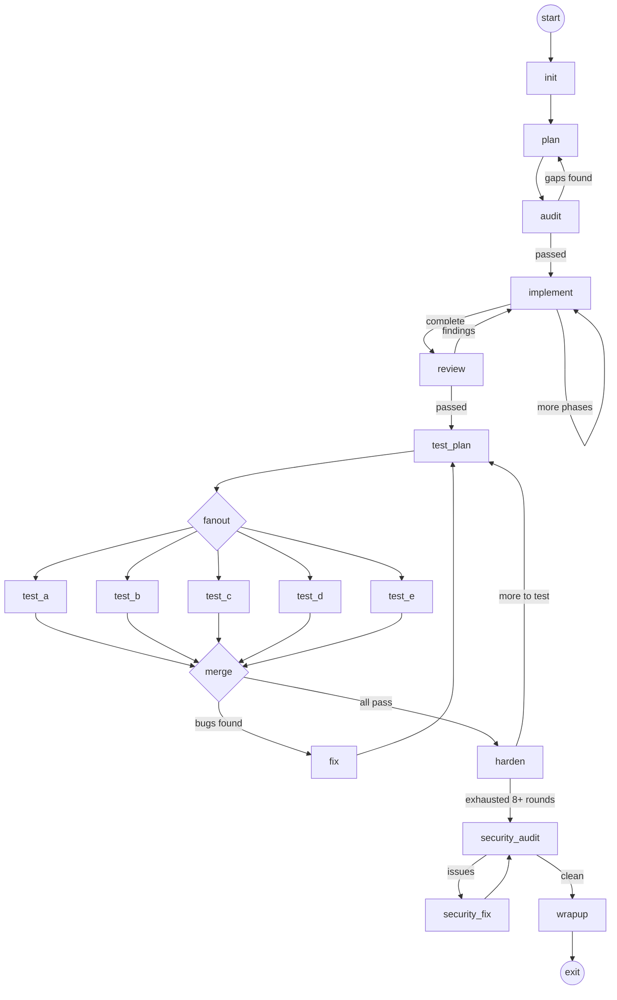

# Permit

A mobile app for managing permission slips for youth group events. Group leaders create events, parents register their children with a single tap. Child info (allergies, notes) is saved so subsequent sign-ups are instant.

No login required -- identity is device-based.

## How it works

1. **Create a group** with a name and password. Share the join code.
2. **Parents join** the group by entering the code + password.
3. **Add children** once -- name, allergies, notes are saved on the device.
4. **Leader posts an event** -- all group members get a push notification.
5. **Parents tap "Yes"** to register each child. One tap. Done.

## Tech stack

- **Frontend:** React Native (Expo)
- **Backend:** Go
- **Database:** PostgreSQL (Cloud SQL)
- **Deployment:** Google Cloud Run
- **Notifications:** Firebase Cloud Messaging

## Project structure

```
backend/          # Go API server
frontend/         # React Native Expo app
SPEC.md           # Full specification
.attractor/       # Attractor build pipeline
  flows/build.dag # DAG definition
  prompts/build/  # Agent prompts
```

## Build pipeline

This project is built autonomously using [Attractor](https://github.com/talmage89/attractor). The DAG defines a multi-phase pipeline with escalating validation:



**Phases:**
1. **Plan + Audit** -- break spec into implementation phases, verify completeness
2. **Implement + Review** -- build in batches of 3 phases, diff-based code review
3. **Test (x5 parallel)** -- 5 agents test concurrently with distinct focus areas
4. **Harden** -- escalate test difficulty across 11+ round categories, loop back to testing
5. **Security Audit** -- OWASP-style review of the full codebase
6. **Wrapup** -- final validation and summary

## Docs

- [SPEC.md](SPEC.md) -- full app specification (data models, API, screens)
